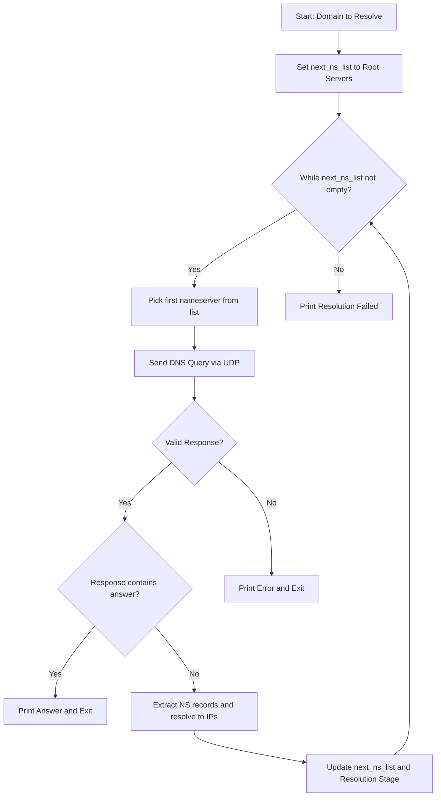

# DNS Resolver

This project implements both **iterative** and **recursive** DNS resolution. It resolves domain names by querying root servers and following the DNS hierarchy until an answer is obtained. The implementation uses the Python **dnspython** library to construct, send, and process DNS queries.

---

## 🔹 Features

### ✅ Implemented

- **Iterative DNS Lookup:**
  - Starts with a predefined set of root DNS servers.
  - Queries a server for an A record.
  - If no answer is found, extracts NS records from the authority section.
  - Resolves NS hostnames to IP addresses and continues lookup through TLD and authoritative servers.
  
- **Recursive DNS Lookup:**
  - Uses the system's default DNS resolver (e.g., Google DNS, ISP DNS) for a recursive lookup.
  - Returns all A records found for a given domain.

### ❌ Not Implemented

- **Advanced Error Handling & Retries:**
  - Basic exception handling is included, but retry strategies (e.g., switching servers on failure) are not implemented.

---

## 🔹 Design Decisions

### 🔹 Use of UDP for DNS Queries
- Queries are sent over **UDP** for efficiency.
- A **3-second timeout** (defined in `TIMEOUT`) ensures responsiveness while handling network variability.

### 🔹 Iterative vs. Recursive Resolution
- **Iterative Resolution:** Starts at the root, moving down the hierarchy, manually extracting and resolving nameservers.
- **Recursive Resolution:** Uses the system’s built-in recursive resolver for ease and comparison.

### 🔹 Timeout Configuration
- The **3-second timeout** balances waiting time with failure handling.

---

## 🔹 Implementation Details

### 🛠️ High-Level Overview

Key functions in the project:

- **`send_dns_query(server, domain)`** → Constructs and sends a DNS query.
- **`extract_next_nameservers(response)`** → Extracts NS records and resolves them.
- **`iterative_dns_lookup(domain)`** → Manages iterative resolution (ROOT → TLD → AUTH).
- **`recursive_dns_lookup(domain)`** → Uses the system’s resolver for recursive lookup.

### 🔹 Code Flow (Iterative DNS Lookup)

### 🔹 Execution Steps

1. **Initialization:** Start with a list of root servers.
2. **Query:** Send a DNS request.
3. **Response Handling:** Extract answers or NS records.
4. **Stage Transition:** Move from ROOT → TLD → AUTH servers.
5. **Termination:** Stop when an answer is found or no responses remain.

---

## 🔹 Testing

### ✅ Correctness Testing

- **Verified with domains:** `google.com`, `example.com`, and compared results with `nslookup` and `dig`.
- **Comparison:** Ensured consistency between iterative and recursive lookups. But due to caching and the way servers are queried, results may vary.

### ✅ Stress Testing

- **Timeout/Error Handling:** Tested against unresponsive DNS servers.
- **Edge Cases:** Checked behavior for invalid domains and missing A records.

---

## 🔹 Restrictions

- **Resource Constraints:**
  - **Message Size:** Limited by UDP and DNS server configurations.

---

## 🔹 Challenges Faced

- **Handling Network Unreliability:**
  - Managing UDP timeouts and non-responsive servers.
- **NS Record Resolution:**
  - Extracting and converting NS records to IPs reliably.
- **Debugging:**
  - Ensuring correct transitions between ROOT, TLD, and AUTH servers.

---

## 🔹 Contribution

👤 **Palagiri Tousif Ahamad (220744):** 100% Contribution

---

## 🔹 References

- 📖 [dnspython Documentation](http://www.dnspython.org/)
- 🔗 Various online networking & DNS resolution tutorials.

## Link

*   **Project Repository:**
    *   [DNS Resolver GitHub Repository](https://github.com/Python-Pi/DNS-resolver)

---
